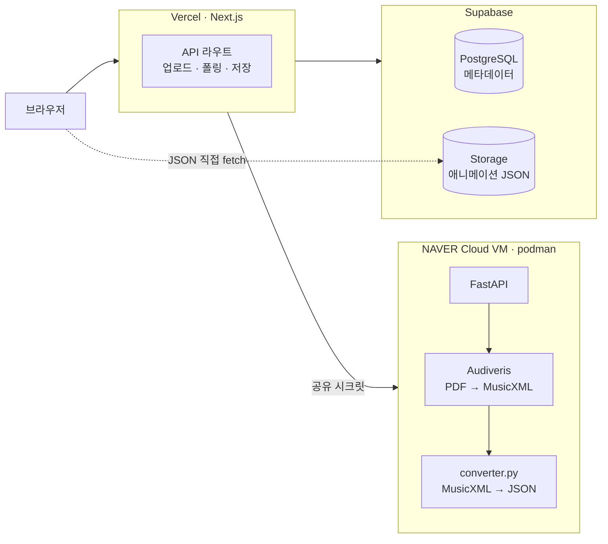

# ClairKeys

가지고 있는 PDF 악보를 피아노 건반으로 떨어지는 노트 애니메이션으로 바꿔 주는 웹 애플리케이션이다.
악보를 읽지 못해도 노트가 건반에 닿는 순간을 보고 따라 칠 수 있게 하는 것이 목표다.

- 배포: <https://clairkeys.vercel.app>
- 저장소: <https://github.com/landfill/ClairKeys>

## 지원 범위

현재 실제로 동작이 확인된 기능이다. 확인되지 않았거나 동작하지 않는 항목은 [제한사항](#제한사항)에 따로 적었다.

| 기능 | 상태 | 설명 |
|---|---|---|
| PDF 업로드와 악보 변환 | 지원 | 최대 4MB PDF를 Audiveris로 인식해 애니메이션 JSON으로 변환한다. 변환에는 보통 1~3분이 걸리고, 페이지를 닫아도 서버에서 계속 진행된다 |
| 낙하 노트 재생 | 지원 | 건반 위로 노트가 떨어지고, 히트라인에 닿는 시점이 발음 시점이다. 건반은 곡에 쓰인 음역(최대 A0~C8)에 맞춰 화면 너비를 채우도록 그린다 |
| 피아노 음원 재생 | 지원 | 31개 샘플 음원을 Web Audio API로 피치 시프트해 재생한다 |
| 재생 속도 조절 | 지원 | 0.5배에서 2배까지 |
| A–B 구간 반복 | 지원 | 시작점과 끝점을 찍어 어려운 구간만 반복한다 |
| 빠르기(BPM) 입력 | 지원 | 업로드할 때 20~400 범위로 직접 입력한다. 비워두면 빠르기 미상으로 표시하고 임의의 값을 채우지 않는다 |
| 소셜 로그인 | 지원 | Google, GitHub (NextAuth.js, JWT 세션) |
| 내 악보 관리 | 지원 | 카테고리 분류, 곡명·작곡가 검색, 목록에서 공개·비공개 상태 표시. 공개 여부는 업로드할 때 정한다 |
| 공개 악보 탐색 | 지원 | 로그인 없이 `/explore`에서 목록을 보고 `/sheet/[id]`에서 재생할 수 있다 |
| 모바일 가로 재생 | 제한적으로 지원 | 세로 기기에서 재생을 시작하면 화면을 90도 회전한 레이아웃으로 건반을 넓게 보여준다. 전용 전체화면·제스처 UI는 [미지원](#제한사항) |

## 동작 방식



1. 사용자가 `/upload`에서 PDF와 곡 정보를 올린다.
2. Next.js가 `SheetMusic` 행을 만들고 OMR 서비스에 변환을 요청한다.
3. OMR 서비스가 Audiveris로 PDF를 MusicXML로 바꾸고, 변환기가 이를 애니메이션 JSON으로 만든다.
4. 브라우저가 약 5초 간격으로 상태를 폴링하고, 완료되면 Next.js가 결과 JSON을 Supabase Storage에 저장한다.
5. `/sheet/[id]`가 그 URL을 내려주고, 브라우저가 JSON을 직접 받아 재생한다.
6. 오디오와 낙하 노트는 하나의 `AudioContext` 시계를 기준으로 스케줄한다.

자격증명 배치, 실패 처리, 애니메이션 JSON 형식은 [docs/architecture.md](docs/architecture.md)에 있다.

## 기술 스택

| 영역 | 사용 기술 |
|---|---|
| 프론트엔드 | Next.js 15 (App Router), React 19, TypeScript, Tailwind CSS 4 |
| 백엔드 | Next.js Route Handlers, Prisma 6, PostgreSQL |
| 인증 | NextAuth.js 4 (Google · GitHub, JWT 세션) |
| 오디오·렌더링 | Web Audio API, 샘플 음원 mp3 |
| 악보 인식 | Audiveris 5.11, Tesseract 5.5.2 (Python FastAPI 서비스) |
| 인프라 | Vercel, Supabase (DB + Storage), NAVER Cloud VM (podman) |
| 테스트 | Jest, Playwright, GitHub Actions |

## 빠른 시작

Node.js 22.3 이상, npm 10 이상이 필요하다.

```bash
git clone https://github.com/landfill/ClairKeys.git
cd ClairKeys
npm install
```

프로젝트 루트에 `.env`를 만들고 아래 필수 항목을 채운다. 전체 목록과 각 값을 얻는 방법은
[docs/environment.md](docs/environment.md)에 있다.

```env
DATABASE_URL="postgresql://..."
NEXTAUTH_URL="http://localhost:3000"
NEXTAUTH_SECRET="..."
GOOGLE_CLIENT_ID="..."
GOOGLE_CLIENT_SECRET="..."
GITHUB_CLIENT_ID="..."
GITHUB_CLIENT_SECRET="..."
NEXT_PUBLIC_SUPABASE_URL="https://PROJECT_ID.supabase.co"
NEXT_PUBLIC_SUPABASE_ANON_KEY="..."
SUPABASE_SERVICE_ROLE_KEY="..."
```

데이터베이스와 스토리지를 준비한 뒤 개발 서버를 띄운다.

```bash
npm run db:generate    # Prisma 클라이언트 생성
npm run db:push        # 스키마 반영
npm run init-storage   # Supabase Storage 버킷(animation-data) 생성
npm run seed           # (선택) 샘플 데이터

npm run dev            # http://localhost:3000
```

PDF 업로드까지 확인하려면 OMR 서비스가 따로 떠 있어야 하고 `OMR_SERVICE_URL`·`OMR_SHARED_SECRET`이
필요하다. 실행 방법은 [omr-service/README.md](omr-service/README.md)에 있다. 이 값들이 없으면
업로드는 행을 만들기 전에 거절되고, 나머지 화면은 정상 동작한다.

## 개발 명령어

```bash
npm run dev              # 개발 서버
npm run build            # 프로덕션 빌드 (prisma generate 포함)
npm run start            # 빌드 결과 실행

npm run lint             # ESLint
npx tsc --noEmit         # 타입 검사

npm test                 # Jest 단위 테스트
npm run test:coverage    # 커버리지 리포트
npm run test:e2e         # Playwright E2E
npm run test:e2e:ui      # Playwright UI 모드

npm run db:push          # 스키마 반영 (개발용)
npm run db:migrate       # 마이그레이션
npm run db:studio        # Prisma Studio
npm run init-storage     # Storage 버킷 초기화
npm run check-data-status # DB·Storage 정합성 확인
npm run analyze          # 번들 크기 분석
```

테스트 범위와 CI 구성은 [docs/testing.md](docs/testing.md)에 있다.

## 프로젝트 구조

```
ClairKeys/
├── src/
│   ├── app/              # Next.js App Router (페이지 + API 라우트)
│   ├── components/       # 화면별 React 컴포넌트
│   ├── hooks/            # 커스텀 훅 (재생, 오디오, 화면 방향 등)
│   ├── lib/              # 인증 설정, 업로드 검사, 경로 정책
│   ├── services/         # 애니메이션 엔진, 파일 저장, 악보 서비스
│   ├── repositories/     # Prisma 접근 계층
│   ├── utils/            # 애니메이션 계약, 건반 레이아웃, 변환 유틸
│   └── types/            # TypeScript 타입 정의
├── omr-service/          # PDF → MusicXML → JSON 변환 서비스 (Python)
├── prisma/               # 데이터베이스 스키마와 시드
├── e2e/                  # Playwright E2E 테스트
├── public/               # 정적 파일, 피아노 샘플 음원, service worker
├── scripts/              # 운영 스크립트 (스토리지 초기화, 데이터 점검 등)
└── docs/                 # 아키텍처·환경·제한사항 문서와 복구 기록
```

주요 라우트: `/`, `/explore`, `/sheet/[id]`, `/upload`, `/library`, `/profile`, `/auth/signin`.
`/upload`, `/library`, `/profile`, `/admin`은 로그인이 필요하다.

## 제한사항

- **악보에 인쇄된 빠르기 표기를 인식하지 못한다.** `♩ = 60` 같은 메트로놈 표기가 MusicXML에
  나타나지 않아, 빠르기는 업로드 시 사용자가 입력해야 한다.
- **OCR이 곡명·작곡가를 자동으로 채우지 않는다.** 화면에 보이는 제목과 작곡가는 업로드 폼에
  입력한 값이다.
- **박자가 맞지 않는 인식 결과를 걸러내지 않는다.** 마디 길이가 박자표와 어긋나도 그대로 재생된다.
- **연습 모드와 따라하기 모드는 미지원이다.** 재생 화면의 모드 선택은 아직 동작하지 않으며, 실제
  동작은 듣기 모드 하나다.
- **전용 모바일 전체화면·터치 제스처 UI는 미지원이다.** 해당 컴포넌트는 코드에 있으나 어떤
  화면에서도 사용되지 않는다.
- **PWA 설치 안내와 푸시 알림은 미지원이다.** service worker는 등록되어 캐싱을 수행하지만, 설치
  프롬프트와 알림 구독 컴포넌트는 마운트되지 않는다.
- **비공개 악보의 애니메이션 파일은 URL만 알면 익명으로 받을 수 있다.** 공개 Storage 버킷을
  쓰기 때문이다.
- **처리 완료 알림이 없다.** 업로드 후 상태는 해당 화면에서 폴링으로만 확인한다.

각 항목의 근거와 관련 이슈는 [docs/limitations.md](docs/limitations.md)에 있다.

## 문서

| 문서 | 내용 |
|---|---|
| [docs/architecture.md](docs/architecture.md) | 서비스 구성, 요청·데이터 흐름, 애니메이션 JSON 형식, 실패 처리 |
| [docs/environment.md](docs/environment.md) | 환경변수 전체 목록과 필수·선택 구분 |
| [docs/limitations.md](docs/limitations.md) | 인식 정확도, 미구현 기능, 알려진 결함 |
| [docs/security.md](docs/security.md) | 자격증명 배치, 서비스 간 인증, 공개 버킷 |
| [docs/testing.md](docs/testing.md) | 테스트 실행 방법과 범위, CI 구성 |
| [docs/deployment.md](docs/deployment.md) | Vercel, Supabase, OMR 서비스 배포 |
| [omr-service/README.md](omr-service/README.md) | OMR 서비스 개발·컨테이너 실행 |
| [docs/recovery/](docs/recovery/) | 설계 결정 기록, 단계별 계획, 검증 로그 |

## 기여

작업 규약은 [AGENTS.md](AGENTS.md)에 있다. 브랜치 전략, 커밋 형식, PR 절차, 검증 기록 방식을
모두 이 문서 하나에서 관리한다.

버그 리포트와 기능 제안은 [GitHub Issues](https://github.com/landfill/ClairKeys/issues)로 받는다.

## 라이선스

저장소에 라이선스 파일이 없다. 사용 조건이 필요하면 이슈로 문의한다.
