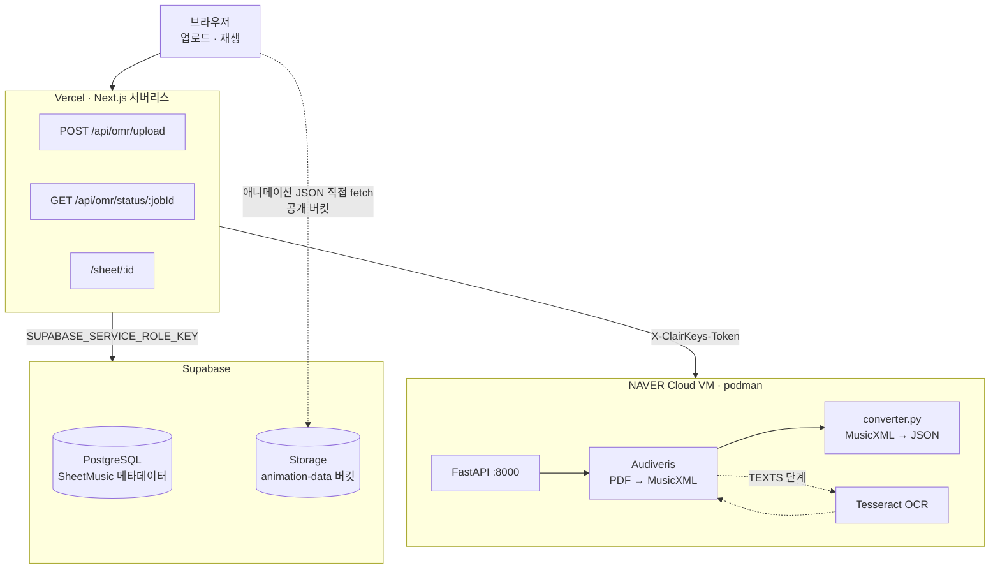
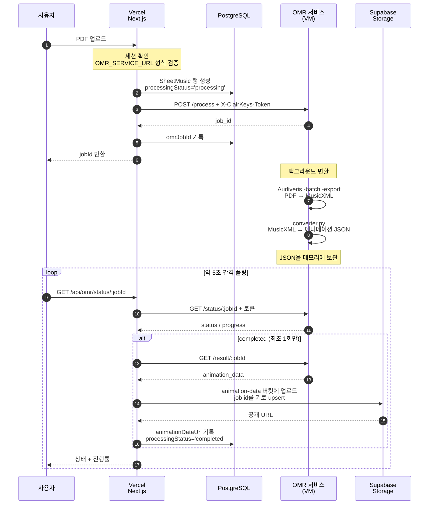
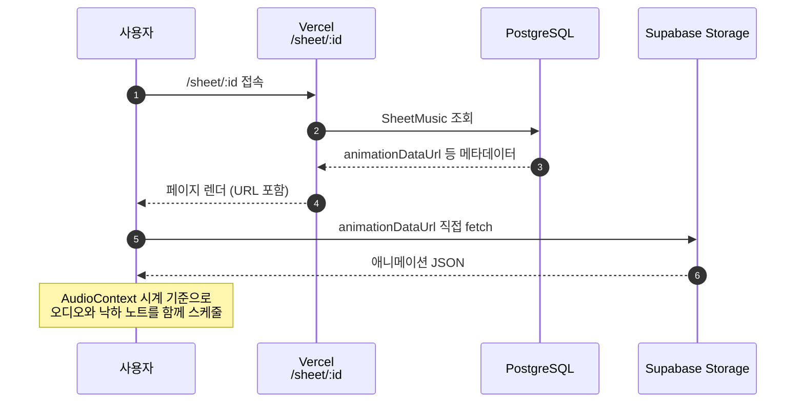

# 아키텍처

ClairKeys는 세 곳에서 나뉘어 실행된다. 나눈 기준은 **어느 자격증명이 어디에 있는가**다
(자세한 내용은 [security.md](security.md)).

| 구성 요소 | 실행 위치 | 하는 일 | 필요한 환경변수 |
|---|---|---|---|
| Next.js 앱 | Vercel (서버리스) | 업로드 접수, 상태 폴링, 결과 저장, 재생 화면 | `SUPABASE_SERVICE_ROLE_KEY`, `OMR_SERVICE_URL`, `OMR_SHARED_SECRET` |
| OMR 서비스 | NAVER Cloud VM (podman) | PDF → MusicXML → 애니메이션 JSON 변환 | `OMR_SHARED_SECRET`(요청 검증용), `ENVIRONMENT` |
| Supabase | 관리형 | PostgreSQL(메타데이터) + Storage(JSON 파일) | — |



## 업로드 → 변환 → 저장



### 이 흐름의 설계 제약

- **JSON 본문은 `/status`가 아니라 `/result`에 있다.** `/status`는 폴링이 끝날 때까지 반복
  호출되므로 수백 개 음표를 매번 실어 보내지 않는다.
- **저장은 job id를 키로 upsert한다.** 두 폴링이 동시에 완료를 관측할 수 있고, 랜덤 파일명을
  쓰면 객체가 둘 생겨 하나가 고아로 남는다.
- **`animationDataUrl`이 이미 있으면 다시 저장하지 않는다.**
- **서비스가 돌려준 제목으로 사용자 입력 제목을 덮어쓰지 않는다.**

## 재생



애니메이션 JSON은 브라우저가 Supabase Storage에서 직접 받는다. `animation-data`는 공개 버킷이라
Vercel 함수를 한 번 더 거치지 않는다.

재생 시각은 `Date.now()`가 아니라 `AudioContext` 시계 하나를 기준으로 삼는다(**P0-C**). 오디오와
시각 요소가 서로 다른 시계를 쓰면 긴 곡에서 어긋난다.

건반은 88개를 고정으로 그리지 않는다. `buildResponsiveKeyLayout`이 곡에 실제로 쓰인 음역을
흰건반 경계로 스냅한 뒤, 화면 너비가 허용하는 만큼 위아래로 번갈아 넓혀 채운다. 상한은 A0~C8의
88건반이다.

재생 오디오는 `src/hooks/useFallingNotesAudio.ts`가 Web Audio API로 직접 구현한다. `public/samples/piano/`의
31개 mp3를 필요한 음높이로 피치 시프트해 쓴다. `tone` 패키지는 의존성에 남아 있고
`src/services/audioService.ts`가 사용하지만, 그 서비스로 이어지는 컴포넌트는 현재 어떤 화면에도
마운트되지 않는다.

## 애니메이션 JSON 형식

```json
{
  "version": "1.1",
  "title": "...", "composer": "...",
  "tempo": null, "tempoSource": "unknown",
  "timingReferenceBpm": 60.0, "scoreTempo": null,
  "duration": 115.2,
  "timeSignature": "4/4", "keySignature": "C",
  "notes": [
    { "midi": 60, "start": 0.0, "duration": 1.0,
      "hand": "L", "finger": null, "voice": 5, "staff": 2 }
  ]
}
```

`start`와 `duration`은 초 단위이고, `hand`는 MusicXML의 staff에서 유도한다. 타이로 묶인 음은 하나의
음표로 합쳐지므로, JSON의 음표 수는 MusicXML의 `<note>` 수보다 적은 것이 정상이다.

빠르기 관련 필드가 넷인 이유는 출처를 지어내지 않기 위해서다.

| 필드 | 뜻 |
|---|---|
| `tempo` | 근거 있는 빠르기. 없으면 `null` |
| `tempoSource` | `score`(악보 인식) · `user`(업로드 폼 입력) · `unknown` |
| `scoreTempo` | 악보에서 인식된 값 그 자체 (사용자 입력이 있어도 보존) |
| `timingReferenceBpm` | 음표 시각 계산에 실제로 쓴 BPM. 항상 채워진다 |

`tempoSource: "score"`는 실제 악보에서 아직 관측된 적이 없다 —
[limitations.md](limitations.md)의 메트로놈 인식 항목 참조.

형식의 정의와 검증기는 `docs/recovery/DECISIONS.md`의 **D-009**에, 정확도 게이트는
`src/utils/__tests__/converterCorpus.test.ts`에 있다.

## 실패 처리

| 상황 | 시점 | 결과 |
|---|---|---|
| `OMR_SERVICE_URL` 미설정·형식 오류 | 업로드 | 행을 만들기 전에 거절 |
| 서비스 연결 불가 | 업로드 | 행을 `failed`로 |
| 서비스 연결 불가 | 폴링 | 503 반환, 행은 그대로 |
| 시크릿 불일치(401) · 서비스 오류(5xx) | 폴링 | 502 반환, 행은 그대로 |
| Audiveris 인식 실패 | 변환 | job이 `failed` → 행도 `failed` |
| 변환 결과 저장 실패 | 폴링 | 행을 `failed` |
| 서비스 재시작으로 작업 유실 | 폴링 | `/status` 404 → 행을 `failed` |

같은 "연결 불가"가 업로드와 폴링에서 반대로 처리되는 것은 의도된 것이다. 업로드 시점에는 행에
`omrJobId`가 아직 없으므로, 실패시키지 않으면 이어받을 작업 없이 `processing`에 영원히 남는다.
폴링 시점에는 `omrJobId`가 있고 서비스에서 작업이 아직 돌고 있을 수 있으므로, 여기서 행을
실패시키면 복구 가능한 작업을 파괴한다.

폴링에서 행을 실패시키는 유일한 비정상 응답은 404다. 변환 작업 상태는 서비스 프로세스 메모리에
있어 재시작하면 사라지고, 404만이 "작업이 영구히 없다"는 뜻이기 때문이다.

과거에는 업로드 경로 넷 중 셋이 PDF를 열지도 않고 파일 크기로 고른 데모 멜로디를 실제 악보와
구분 불가능하게 저장했다. 그 경로들은 제거됐다(**D-010**). 남은 데모 데이터는
`SheetMusic.provenance` 열(`omr` · `demo` · `unknown`)로 구분하고, 화면에 그 사실을 표시한다.
